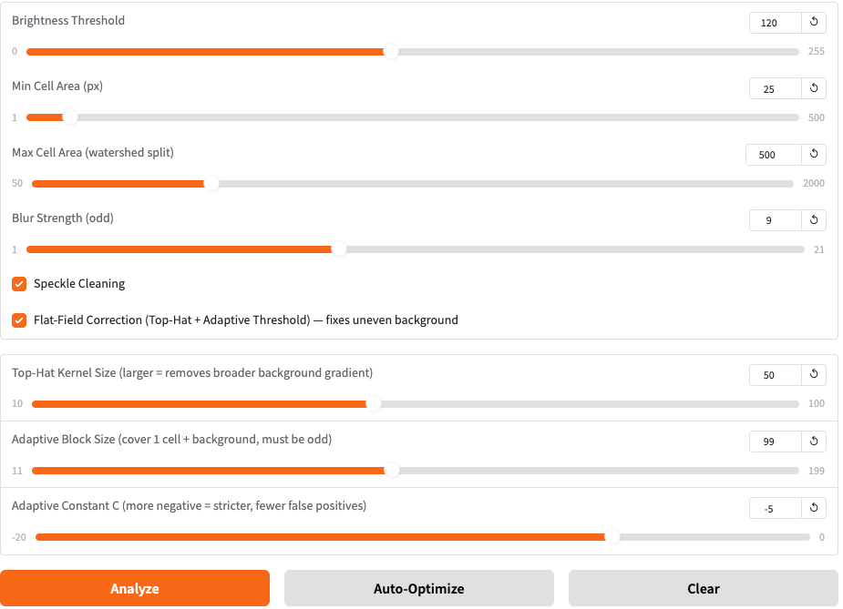
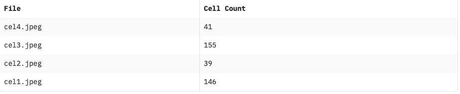
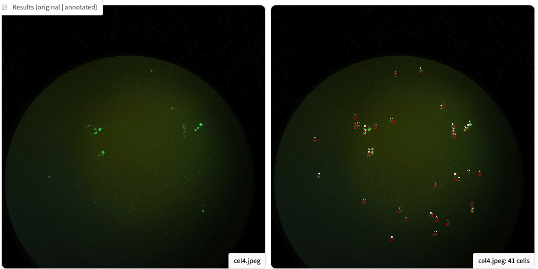

# Fluorescence Cell Counter

A web-based tool for counting fluorescent cells in microscopy images. Upload your images, tune detection parameters, and get instant annotated results with cell counts.

Live at [ferar.cloud/cc](https://ferar.cloud/cc)

---

## Features

- **Batch processing** — upload up to 20 images at once
- **Interactive parameter tuning** via sliders (no code changes needed)
- **Clump splitting** — watershed algorithm separates touching cells
- **Flat-field correction** — top-hat filter + adaptive threshold handles uneven backgrounds
- **Auto-Optimize** — grid search finds the most stable parameter set for your image
- **Manual annotation** — click on the image to mark cells the algorithm missed
- **Gallery & side-by-side views** — compare original vs. annotated

---

## Screenshots

### Control Panel



Tune brightness threshold, cell size limits, blur strength, and advanced flat-field correction — all without touching any code.

### Results Table



Each image gets an automatic cell count. Results are shown in a sortable table alongside the annotated gallery.

### Original vs. Annotated



Red circles mark detected cells. Side-by-side view lets you compare originals and annotations at a glance.

---

## Stack

- **Python** backend
- **[Gradio](https://gradio.app)** web UI
- **OpenCV** — image processing pipeline
- **NumPy / Pandas** — array ops and CSV export

---

## Quickstart

```bash
# Clone and set up
git clone <repo-url>
cd celulas
uv venv
source .venv/bin/activate
uv pip install -r requirements.txt

# Run
python main.py
# → open http://localhost:7860/cc
```

---

## Detection Pipeline

1. Extract **green channel** from BGR image
2. **Gaussian blur** to merge nearby bright regions
3. **Thresholding** — global (brightness slider) or adaptive (flat-field mode)
4. Optional **flat-field correction** via top-hat morphology + adaptive threshold (fixes uneven backgrounds)
5. Optional **morphological opening** to remove speckle noise
6. **Connected components** to find and count blobs above `Min Cell Area`
7. **Watershed** on large blobs (`> Max Cell Area`) to split clumped cells
8. Draw red circles + numbers on a copy of the original image

---

## Parameters

| Parameter | Default | Effect |
|---|---|---|
| Brightness Threshold | 120 | Higher → ignore dimmer spots |
| Min Cell Area | 25 px | Higher → ignore small debris |
| Max Cell Area | 500 px | Blobs above this get watershed-split |
| Blur Strength | 9 | Larger → merge split cells (must be odd) |
| Speckle Cleaning | On | Morphological opening removes noise |
| Flat-Field Correction | On | Top-hat + adaptive threshold for uneven backgrounds |
| Top-Hat Kernel | 50 | Larger → removes broader background gradients |
| Adaptive Block Size | 99 | Should cover ~1 cell + surrounding background |
| Adaptive Constant C | -5 | More negative → stricter, fewer false positives |

---

## Manual Annotation

After running analysis, select an image from the dropdown under the results. Click anywhere on the image to mark a cell the algorithm missed (shown in green). Use **Undo Last Click** to remove the most recent mark. The total count updates in real time.
